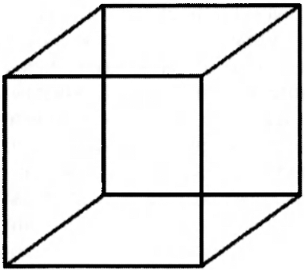
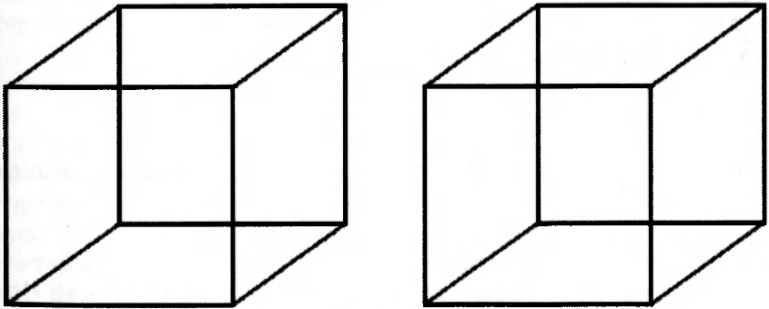
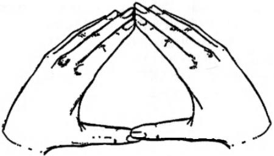
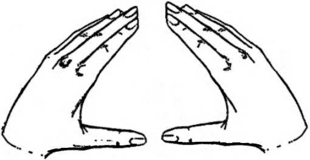

= Aktyvi sąmonė.
v1.0, 2020-06-07
:example-caption!:
:sectnums:
:sectnumlevels: 3

= 1. Skirsnis. Psichonetinės technikos

== Skyrius. Valios psichotechnikos bendrame psichotechnikų kontekste
== Skyrius. Valios psichotechnikos: principai ir apibrėžimai
== Skyrius. Valios meditacija
=== Atlikimo technika
Valios meditacija yra pagrindinė technika psichonetiniame darbe. Jos paskirtis - trijų tarpusavyje susijusių
pozicijų pasiekimas. Tai:

intensyvus realaus savojo "Aš" pergyvenimas;

"Aš" atskyrimas nuo bet kokių sąmonės turinių ir formų;

vidinės laisvės nuo stimulų, valdančių sąmonę patirties įgyjimas;

Valios meditacija tai ne vienų psichinių darinių darbas su kitais, ne jų tarpusavio sąveika, tai iškelto už bet kokių
sąmonės
organizuotumų "Aš" darbas su visu psichikos totalumu.

Nereikia galvoti, kad valios meditacija tai valios veiksmas. Pradinėse valios meditacijos mokymosi stadijose valios
meditacija vaizduoja valios veikimą, yra
atvaizdas, imitacija, bet ne valios pažadinimas, nors, be abejo, valios meditacija - ryškiausiai imituoja valios
realybes. Nėra valios veiksmo išprovokavimo būdo,
bet imituojant jį, galima įgyti supratimą apie tai, kaip valia susijusi su Pasaulio sąlygotumo aspektais. Praktikos eigoje valios veikimo imitacija
palaipsniui priartina prie realybės ir, galiausiai, pažadina valią.

Valios meditacijos atlikimui reikia užimti patogią padėtį. Pageidautina ištiesinti nugarą. Tai nėra ritualinio pobūdžio reikalavimas - nesąmoningai
išėjus iš valios meditacijos praktikas nesugebės išsaugoti tiesios nugaros, tai reikš, kad valios meditacija baigėsi.

Valios meditacija - tai veiksmas, kylantis ne iš "sąmonės organizmo", o iš siekiančio valios būsenos "Aš". Veiksmas,
principe, gali būti bet koks, bet geriau, kada jame koncentruotu pavidalu būtu valios meditacijos idėja. Veiksmui, kurį
atlieka
"Aš", pasirenkamos dvi formulės, kurios yra valios meditacijos idėjos verbalinis išpakavimas.

Pirma valios meditacijos formulė - "Aš esu". Tai sena, daugybėje praktikų naudojama formulė, teigia, pirma,
tariančio šią formulę egzistavimo ir atsakomybės už savo egzistavimo faktą (tai sukelia ryškų savojo "Aš"
suvokimą), ir, antra, atskiria gryną "Aš" (stebinčią ir veikiančią instanciją) nuo viso sąmonės turinio.

Egzistavimo realumo patirtis - tai ne trivialus veiksmas. Daugumas žmonių gyvena savo gyvenimą nesuvokdami
"Aš" realumo, o tarsi žiūrėdami kiną apie savo gyvenimą, bet ne valdydami jį aktyviai. Idėjinis "Aš esu" formulės
komponentas (jeigu dėmesys susitelkęs ant tos idėjos) priverčia pajausti susitelkimą ties savimi, savęs
kompaktiškumą, išskirtinumą bendrame Kosmoso audinyje. Tai visai ne banali savęs ir Pasaulio priešprieša, tai,
greičiau, transcendentinės ir imanentinės sąmonės sudedamųjų dalių atskyrimas. Transcendentinis, stebintis ir
veikiantis "Aš" prieš visas žmogiškosios būtybės sudedamąsias dalis, kurios įtrauktos į bendrą gyvenimo srautą,
atspindi šį srautą ir priklauso nuo jo.

"Aš" atskyrimas nuo viso kito sudaro antrą valios meditacijos komponentą. "Aš esu" apeliuoja į gryno "Aš" patirties ir aktualios
psichinės struktūros nesutapimą. Tuo pačiu sukuriamos poveikio sąmonės struktūroms ir sąmonės procesams prielaidos -
subjekto ir objekto veiksmai aiškiai atskiriami vienas nuo kito. Vis dėl to negalima sakyti, kad valios meditacijoje
"Aš" nuo pat pradžių veikia kaip valios subjektas. Čia, greičiau, "Aš" veikia taip, tarsi valios "Aš" aspektas būtų
pažadintas. Valios meditacijoje nėra pagrindinės valios veiksmo charakteristikos - jo besąlygiškumas išorinėms
priežastims. Yra priežastis - užsiėmimų vadovo tekstas arba instrukcija, bet yra ir vidinis veiksmas - nutarimas vykdyti
valios meditaciją. Nuo nutarimo atlikti valios meditaciją vykdoma kaip valios veiksmą imituojanti procedūra ir kuo
toliau realios
sąlygos (tiek
išorinės, tiek vidinės) nuo sąlygų, kuriose buvo nutarta pradėti valios meditaciją, tuo valios meditacija darosi
sąmoningesnė ir
artimesnė valios
veiksmui.

Antroji valios meditacijos formulė - "Aš esu valia". Šios formulės idėja skiriasi nuo "Aš esu". Jeigu "Aš esu" teigia tik realų "Aš"
egzistavimo faktą, tai "Aš esu valia" pabrėžia "Aš" aktyvumą. Ritmiškas formulių kaitaliojimas abipusiai stiprina
viena kitą. "Aš esu valia" imituoja ir tuo pačiu provokuoja trečią valios meditacijos komponentą - besąlygišką veiksmą. Bet koks
sąlygotumas iš antros formulės pozicijos laikomas įvykiu, atsirandančiu "Aš" ir valios išorėje.

Valios meditacijos eigoje svarbu išsivaduoti nuo jos formalių išraiškų ir pereiti į idėjų erdvę. Ši užduotis
palengvinama padalinant valios meditaciją į tris fazes.

Pirmoji fazė - tai vidinis formulių tarimas. Tai kalbos aparato veiksmas, audialinis skambesys ir
tariamų frazių idėjos. Pirmoji fazė tęsiasi iki stabilaus dėmesio ties formulėmis atsiradimu. Kada pasiektas
stabilumas ir dėmesio blaškymasis minimalizuotas, pridedama antroji fazė - tarimo slopinimas ir susikoncentravimas tik
ties audialiniu skambesiu ir idėjine formulių sudedamąja dalimi. Pirmoje valios meditacijos fazėje dėmesys sutelktas
ties kalbos organais, liežuvis šiek tiek įtempiamas ir, galimai, net juda, imituodamas kalbos garsus. Būtent šie
veiksmai slopinami antrojoje fazėje, o dėmesys sutelkiamas į galvos centrą arba į apimtį tarp ausų.

Antroje fazėje lieka tik skambesys ir formulių idėjos. Skambesys formuojamas vidinėmis pastangomis, formulių idėjos
išpakuojamos į skambesį. Pirmoji ir antroji fazės - tarimas ir skambesio išpakavimai - kaitaliojami ir remia viena kitą.

Kada dėmesio koncentracija ties šiuo dvigubu veiksmu tampa stabilia, pridedama trečioji fazė: išpakuojama tik
atitinkanti formules "Aš esu" ir "Aš esu valia" pozicija. Tam reikia atlikti pastangas, kurios bus nukreiptos į
skambesio išpakavimą, bet vietoje skambesio išpakuoti būseną. Tada valios ketinimas išpakuojamas į būseną, be
garso, be kalbos organų įtempimo, be skambesio. Mes vadiname šią fazę - begarsis formulių išpakavimas.

Pradžioje trečiąją fazę lydi neapibrėžti, bet mobilizuojantys pojūčiai kūne, bet jie turi būti laikomi viena iš
"skambėjimo" formų. Palaipsniui ši forma pakeičiama gryna "Aš esu, Aš esu valia" pozicija, kuri yra ne jaučiamoji,
bet idėjinė patirtis. Praktikos pradžioje trys fazės turi keisti viena kitą, bet pagrindinis valios meditacijos
taikinys yra trečioji fazė. Palaipsniui ji turi tapti dominuojančia - vienam pirmų dviejų fazių išpakavimui pradžioje
reikia daryti 2-5, paskui 10 trečių fazės išpakavimų. Pirmoji ir antroji fazės tampa pagalbinėmis, prie kurių
pereinama, kad palaikyti trečiąją.

Pirmoji, antroji ir trečioji fazės turi būti laikomos valios ketinimo išpakavimu, kuris kyla iš "Aš", atliekamas
sąmonės turinio aplinkoje. Visos sąmonės turinyje atsirandančios - mintys, reginiai, atsiminimai, jausmai - laikomi
pašaliniais, "ne savi", esantys už "Aš" ribų. Valios meditacija - tai nuoseklus "Aš" nuo sąmonės turinio atskyrimas.
Bet tai prieštaringas procesas. Idėjinė valios meditacijos sudedamoji dalis išpakuojama į sąmonės turinį, bet
turinį kontroliuoja "Aš". Tik jie yra vidinio aktyvumo produktai. Veikiant empirinės psichikos ribose, "Aš" sukuria
valios placdarmą tarp sąmonės turinio, kuris sudaro sąmonės organizmo visumą.

=== "Sąmonės organizmo" priešinimasis valios meditacijai

Sąmonės organizmas padarytas iš sąmonės "materijos", pas šitą organizmą yra savi poreikiai ir uždaviniai. Atskyrimas
jame valios "Aš", valios pažadinimas arba bent tokio pažadinimo imitacija, įveda naują vadovaujančią instanciją, kuri
pozicionuojama virš "sąmonės organizmo". Aišku, "sąmonės organizmas" priešinasi šiai operacijai. Jis bando
"įtraukti" atsiskyrusį "Aš" atgal, užmigdyti valią, pakeisti valios veiksmą jo atvaizdu aktyvios psichikos materiale.

Pirmas priešinimasis - dėmesį blaškančios mintys ir reginiai, kurie magnetizuoja dėmesį. Jie turi būti laikomi
vieninteliam sąmoningam valios meditacijos veiksmui išoriniais trukdžiais.

Antras - nuobodulio ir susierzinimo nuo ilgo pratimo atlikimo atsiradimas, noras kuo greičiau užbaigti valios
meditaciją. Šią būseną reikia taip pat laikyti išoriniu trukdžiu, kuris yra svetimas "Aš", kaip tai, kas trukdo
atlikti valios meditaciją.

Trečias priešinimosi tipas - svarbių, ryškių ir įdomių minčių, įžvalgų, idėjų, kurias norisi apgalvoti, apžvelgti,
užsirašyti atsiradimas. Tam sunku priešintis, tarp šių minčių pasitaiko iš tiesų svarbios ir vertingos idėjos. Bet
šias mintis, jų svarbos vertinimą reikia taip pat laikyti "sąmonės organizmo", besistengiančio nutraukti valios
meditaciją veikla.

Galiausiai, pats subtiliausias priešinimasis - valios meditacijos imitacija. Meditatorius pradeda tarti formules
automatiškai, nejausdamas jų prasmės. "Sąmonės organizmas" stropiai atkuria valios meditacijos fenomenologiją,
slopindamas patį svarbiausią - naujo psichikos valdymo centro atsiradimą, kuris nepriklausomas sąmonės organizmo
sąlygotumo. Čia svarbu skirti - kas atsiranda iš valios "Aš" ir kas ateina iš išorės, iš "sąmonės organizmo".
Kriterijumi gali pasitarnauti valios meditacijos nutraukimo pagrindo buvimas arba nebuvimas be praktiką atliekančio
nutarimo, kuris gimsta iš valios "Aš". Valios meditacijos praktikoje jokie išoriniai ir vidiniai įvykiai, kokie svarbūs
bebūtų "sąmonės organizmui", nėra valios meditacijos nutraukimo pagrindas, nes valios meditacijos valdymas gimsta
valios "Aš", o ne iš atskirų aktualios psichikos aspektų.

=== Valios meditacijos atskyrimas nuo psichinių procesų

Kada valios meditacija atskirta nuo jos atspindžio psichikos erdvėje, valios meditacija tampa efektyvia ir gali tęstis ilgą laiką. Jei šio atskyrimo nėra, valios meditaciją įtakoja sąmonės organizmo būsenų dinamika.

Valios meditacija turi pradėti "Aš", bet praktikos pradžioje, kaip taisyklė, valios meditacija inicijuojama asmenybės struktūromis. Tai reiškią, kad sąmonės organizmas tarsi "projektuoja" valios meditaciją, ir valios meditacijos procesas nėra realus "Aš" išlaisvinimas nuo asmenybės struktūrų, o būsimos valios meditacijos atspindys aktualioje psichikos būsenoje. Šiuo atveju valios meditacija prasideda ne iš "Aš" aktyvumo, bet formuojama psichikos organizmo viduje, remdamasi jame vykstančiais psichiniais procesais. Būdama vienu iš šių procesų, valios meditacija sąveikauja su jais, yra priklausoma nuo jų ir gali būti nutraukta dėl nuovargio, mieguistumo, dėmesio blaškymusi į ateinančius iš išorės arba vidaus stimulus.

Pereiti į valios meditacijos poziciją galima, tik nutraukus "Aš" ryšį (ir, reiškia, valios meditacijos) su sąmonės organizme vykstančiais procesais. Tam būtina užimti valios meditacijos rezultatų stebėjimo poziciją, vykdanti palaipsniui atsiskyrimą nuo valios meditacijos eigoje formuojamos būsenos. Valios meditacijos vykdomos "Aš" nuo sąmonės organizmo procesų atskyrimo metu, valios meditacija tampa nepriklausoma nuo šių procesų, turi galimybę išpakuoti sąmonės organizme valios meditacijos idėjos turinį. Sąmonė įgyja kitokią hierarchinę struktūrą - "Aš" aktyvumas išsidėsto virš sąlygotų psichikos procesų, tai atveria kelią realiam valingojo "Aš" vidinės laisvės įgijimui.

Atskyrimui padeda valios meditacijos padalinimas į du taktus - "Aš esu" ir "Aš esu valia". Vieningos formuluotės atveju jos palaikymo pastangos dažniausiai atliekamos palaipsniui, o todėl nepastebimos, išsenka, dvitaktės formulės leidžia grįžti į pradinę poziciją.

Valios meditacijos ir psichikos procesų atskyrimas, ir jų padalinimas leidžia, pirma, atlikti valios meditaciją labai ilgą laiką, ir, antra, daro valios meditacijos procesą nepriklausomu nuo esamos sąmonės būsenos - valios meditacija gali būti tęsiama nuovargio būsenoje, miegant, alternatyviose(pakeistose) sąmonės būsenose, sukeltose įvairių faktorių. Tik šiuo atveju galima kalbėti ne apie valios meditacijos būseną, o apie valios meditacijos poziciją. Tokią valios meditaciją vadinsime atskirta.

=== Valios meditacija: būsenų išpakavimas ir sinestezijos panaudojimas

Valios meditacijoje reikia skirti idėjų turinius ir patį jų išpakavimo procesą. Valios meditacijos mokymosi pradžioje trečioje fazėje išpakuojamos formulių "Aš esu, Aš esu valia" idėjos, bet jeigu kartu su valios meditacijos formulėmis įvesti papildomus turinius, tada trečioje fazėje jie išpakuojami į būseną, kaip valios meditacijos formulės. Taip, galima išpakuoti tai ar kitai spalvai, garsui, figūrai, taktiliniam jausmui, judėjimui atitinkančią būseną.

Rekomenduojama praktika: ištarus pirmos fazės formules atsiminti reikiamą(arba pasirinktą) spalvą, išpakavus antros fazės garso atvaizdą vaizduotėje sukurti spalvą ( reikia skirti spalvos sukūrimą nuo atsiminimo - tai yra atmintyje nuo sukūrimo vaizduotėje), o paskui pastangas nukreiptas į spalvos sukūrimą, nukreipti į būsenos formavimą.

Sekantis žingsnis yra valingas spalvos pasirinkimas be atramos į jo apraiškas arba pavadinimą ir "spalvos būsenos" išpakavimas analogiškas būsenai, atitinkančiai valios meditacijos trečioje fazėje. Tokia operacija, iš vienos pusės, duoda galimybę suprasti "žinojimą nesiremiant forma", iš kitos - pereiti prie savavališko reikiamų būsenų formavimo, iš trečios - pradėti sinestetinių atitikmenų naudojimo praktiką sprendžiant įvairias užduotis užduotis.

Išties, trečioje valios meditacijos fazėje randasi potenciali bet kokio turinio išpakavimo proceso atlikimo galimybė, į kurį galima žiūrėti kaip į abstraktų sinestezijos procesą. Sinestezija yra tam tikros funkcijos kitose funkcijose atspindys. Valios meditacijoje idėjų, ištrauktų iš kitų turinių(tai yra supakuotų iš jausmais suvokiamų tos ar kitos funkcinės zonos formų į atitinkančias jas idėjas) išpakavimo procesas, gali būti vykdomas kitose funkcinėse aplinkose. Tuo pačiu sinestezijos suprantamos plačiai - taip, galima pervesti įsivaizduojamą vaizdinį iš vaizduotės funkcinės aplinkos į taktilinę arba emocinę sritį. Pirmi sėkmingi sinestetiniai perkėlimai leidžią suprasti, kaip išpakuoti šilumos arba šalčio jausmą, ir euforijos būseną, ir raumenų atpalaidavimą, ir budrumą. Tokia patirtis leidžia pereiti į ketvirtą valios meditacijos fazę - švaraus išpakavimo proceso, neužpildant šio proceso jokiu idėjos turiniu.

Ši praktika, tai valios impulso trajektorijos pakeitimas remiantis sinestezijos procesu. Taip, ketinimą išpakuoti vienokią ar kitokią geometrinę figūrą galima nukreipti ne į spalvotų geometrinių figūrų sritį, bet į garsų sritį ir "išgirsti" pasirinktos figūros "skambesį". Vizualios figūros idėja išpakuojama kitoje funkcinėje zonoje. Pradžioje tai ne stabilus procesas - figūrą atitinka idėja, kurią mes stipriname, slopindami jos jaučiamą ekvivalentą, ir, priešingai, idėjai iškart atitinka figūra, garsas, arba kūniški jausmai, bet palaipsniui sekančių pratimų eigoje reikia išmokti suteikti šiems procesams tolydų bruožą. Tai svarbus praktikos momentas - pokyčių tolydumas leidžia stabiliai fiksuoti idėją, kurioje randasi valios impulsas, ir skirti ją nuo jaučiamų modifikacijų.

Užduoties vykdymo rezultatai pas skirtingus žmones skiriasi taip pat, kaip jų sinestetinė patirtis - "garsoraidę" (vizualinės figūros ir skambesio suvokimas) "A" dauguma suvokia kaip "raudoną", bet dalis "mato" kaip baltą, žydrą arba smėlio spalvos. Praktinis sinestezijos naudojimas ribojasi būtent šiomis individualiomis sinestetinio akto variacijomis. Psichonetinėje praktikoje sukurti metodai, leidžiantys atlikti unifikuotą procedūrą, kurios rezultatai būtų vienodi visiems dalyviams(žodžių ir vizualinių figūrų piktografijos metodika, kuri randasi vizualinių psichonetinių kalbų konstravimo rėmuose).

=== Rezultatai

Valios meditacija, kaip ir bet kuri psichonetinė technika, sprendžia daugiafunkcines užduotis. Pirmoje eilėje, valios meditacija atveda praktiką į darbinę poziciją, iš kurios galimas tikslingas darbas su sąmonės struktūromis. Ypač svarbi valios meditacija, kada dekoncentracinis darbas atveda prie abstrakčių sąmonės zonų suvokimo: trečioje fazėje(tiksliau jos užbaigimas - pozicija) valios meditacija tampa vienintele buvimo ir veikimo švarių idėjų sluoksnyje garantija.

Svarbiausias valios meditacijos rezultatas - realaus laisvo aktyvumo ir susijusio su tuo sąmonės skaidrumo ir pripildyto joje neskaidrumo priešpriešos suvokimas. Ši būsena dažniausia aprašoma kaip pabudimo būsena, tuo pačiu pabrėžiamas radikalus šios būsenos nuo įprastos budrumo būsenos skirtumas, kaip budrumo ir sapno skirtumas.

Sąmonės padalinimas į dvi dalis - valdantis valingas "Aš" ir gyvenantis savo gyvenimą sąmonės organizmas - suteikia galimybę praplėsti empirinę psichikos apimtį, įtraukiant į ją papildomus aspektus, susijusius su "miegančių" sąmonės zonų pažadinimu nenuskriaudžiant pradinių psichikos struktūrų.

Galima išskirti ir pragmatinius valios meditacijos rezultatų aspektus - atsiribojimo būsenos panaudojimas ir tuo pačiu laisvo aktyvumo sprendžiant pragmatinius uždavinius - tokius, kaip atsisakymas nuo mąstymo stereotipų, sprendimų priėmimas ir įvairių baimių ir nuogąstavimų įveikimas. Žvilgsnis į baimę kaip į sąmonės organizmo būseną, neįtakojančią priimant sprendimą ir realią elgseną, leidžia sustabdyti griaunantį baimės poveikį.

Valios meditacijos procesas, ypač trečia fazė, demonstruoja idėjų išpakavimo įtaką organizmo būsenai. Tai suteikia galimybę išpakuoti ir kitas idėjas - mažiau abstrakčias, negu valios meditacijos formulės. Į išpakavimo procesą galima nukreipti bet kokį turinį ir gauti rezultatus, kurie proporcingi autogeninės treniruotės rezultatams.

Galiausiai galima išskirti kaip atskirą darbo objektą ir patį išpakavimo procesą neatsižvelgiant į išpakuojamus turinius. Tai yra ketvirtoji valios meditacijos fazė.

Ketvirtos fazės atskyrimas sukurią valios psichotechnikos pagrindą - reikiamų būsenų formavimą išpakuojant valios impulsą į būseną gaunant atitinkančius šią būseną psichofiziologinius pokyčius. Technikos efektyvumas padidėja, jeigu reikiamos būsenos pasirinkimas vykdomas prieš verbalinį ir prieš vaizduotės lygmenį pereidamas į valios impulso išpakavimą be atitinkamų verbalinių ir vaizduotės komponentų.

Galima išskirti vidinius ir išorinius valios meditacijos atlikimo sėkmingumo kriterijus. Vidinis - abejingas sąmonės organizmo reakcijų iš "Aš" pozicijos reikšmingų stimulų(mobilaus telefono skambesys, naujų veidų patalpoje, kur vykdoma valios meditacija atsiradimas) stebėjimas neleidžiant atlikti atitinkamus veiksmus. Išorinį kriterijų galima įvesti atliekant valios meditaciją atmerktomis akimis. Pasinėrimas į vidinius vaizdinius pasireiškia tolygiais akių judesiais("akys plaukioja"), o užvaldantys dėmesį mąstymo procesų aktyvumo proveržiai - greitais akių obuolių mikro judesiais.

Žymiai rimtesnės valios meditacijos galimybės pasireiškia derinant su dekoncentratyvinėmis praktikomis. Šios galimybės bus apžvelgtos vėliau.

=== Valios meditacija ir mentalinė tyla

Valios meditacijos praktikoje vieninteliai veiksmai, kuriuos vykdo "Aš", - tai valios meditacija. Viskas, kas sąmonėje atsiranda be valios meditacijos operacijų, laikoma šalutiniu, parazitiniu aktyvumu, sąmonės organizmo trukdžiai.

Valios meditacijos užduotis - praktikos metu tapti dominuojančiu, o vėliau vieninteliu, sąmonės procesu. Izoliuotoje valios meditacijoje vieninteliu sąmonės turiniu tampa valios meditacijos pozicija, o tai reiškia, kad bet kuris kitas aktyvumas, laikomas sąmonės organizmo aktyvumu, blėsta. Tokiu būdu, valios meditacijos rezultatas - mentalinė tyla, kurios fone lieka tik "Aš" valingas aktyvumas.

Mentalinė tyla yra valios meditacijos rezultatas ir operacijų valios meditacijos fone efektyvumo sąlyga, o taip pat tolimesnio subjektyvumo stiprinimo progresas. Mentalinė tyla reiškia, kad darbiniais objektais lieka tik idėjų zonos sąmonėje ir idėjų išpakavimo į jausmais apčiuopiamas formas procedūros.

=== Valios meditacija ir valingas "Aš": sąmonės organizmo interpretacija

"Aš" atskyrimo nuo sąmonės organizmo valios meditacijoje procesas interpretuojamas ne valingu "Aš", o sąmonės organizmo psichinėmis struktūromis. Sąmonės organizmas dažniausiai "komentuoja" valios meditacijos procesą, siekdamas panaudoti jį saviems poreikiams. Komentarai nėra tik verbaliniai. Komentarai - tai dviejų reiškinių atspindys: 1) valios meditacijos proceso organizmo būsenose("Aš esu" formulės kompaktiškumo jausmo atspindys, "Aš esu valia" atsispindi tonuso pakilimo jausmu ir kūno aktyvumu), ir 2) Ego priešinimasis ir valios meditacijos organizmui arba asmenybės struktūroms naudingumo arba kenksmingumo interpretacijos.

Nuo pradinės valios meditacijos stadijos eina dvi vidinių veiksmų ir įvykių grandinės: viena atveda prie nuoseklaus "Aš" nuo visų psichikos struktūrų atskyrimo, o kita - prie laipsniško valios meditacijos sąmonės organizmui poveikio vertinimo nutraukimo. Šis išliekantis kažkiek laiko dvilypiškumas gali sukurti paradoksalias būsenas, kada sąmonės organizmas pradeda suvokti išsiskyrusį "Aš" kaip kažką išorinį psichinėms struktūroms.Tuo pačiu galimai aktyvaus "Aš" atstūmimą arba žiūrėjimą į jį kaip į išorinį asmenybei "poną". Dažniausia tokios rūšis suvokiniai greitai praeina, fiksavimasis ties jais gali atvesti prie nepageidaujamų ekscesų.

Svarbu, vykdant valios meditaciją neprarasti pastovaus budrumo. Kas yra aktyvumo vykdant valios meditaciją šaltinis: "Aš" aktyvus, "Aš" veikia ir pastoviomis pastangomis skleidžia į sąmonės organizmą idėjinį srautą, kuris sąmonės organizmo ribose konvertuojasi į žodžius ir vaizdinius, arba "Aš" tik stebi tai, kaip sąmonės organizme gimsta valios meditacijos formulės. Kiekvienoje valios meditacijos procedūros eigoje svarbu uždavinėti šį klausimą.

Nereikia pamiršti, kad valios meditacijos pradinėje stadijoje pagrindinis vaidmuo priklauso asmenybės struktūroms ir stimuliacijoms(motyvuojantys instruktoriaus žodžiai, instrukcijos tekstas ir taip toliau), kurios padeda vykdyti valios meditacijos veiksmus(valios meditacijos formulių išpakavimą). Šiuo atveju negalima kalbėti apie valios meditaciją, greičiau kalbama apie sąmonės organizmo sutikimą vykdyti veiksmus, kurie tik po kažkurio laiko atves prie "Aš" išskyrimo, kuris valdys ir taps nuo asmenybės struktūrų nepriklausoma instancija.

== Skyrius. Percepcinių aplinkų valdymas

=== Percepcinė aplinka

Percepcinė aplinka vadinu viską, kas pasiekiama atskiram suvokimo organui. Yra vizualinės, audio, lytėjimo ir kitos percepcinės aplinkos. Įprastoje budrumo būsenoje suvokimas yra priverstinis ir sąlygotas išorine stimuliacija, percepcinės aplinkos susiklosčiusia organizacija, nuostatomis ir dabartine būsena, tai yra visu tuo, kad randasi "Aš" išorėje. Apžvelgtos šioje knygoje praktikos leidžia: sustabdyti suvokimą; įveikti jo priverstinį bruožą; nukreipti suvokimą atgal, paversti jo funkciją, galinčią ne tik suvokti, bet ir veikti, suteikti suvokimui aktyvaus poveikio supančiai aplinkai savybę.

=== Percepcinės aplinkos valdymas

Valdymas gali vykti remiantis mažai diferencijuotomis psichinėmis struktūromis, taip pat tiesiogiai valdant valia.

Kokiu būdu vyksta percepcinių aplinkų valdymas? Čia svarbūs niuansai. Mažai diferencijuotos struktūros yra sąmonės organizmo dalis, joms veikiant valingas komponentas dalyvauja netiesiogiai. Tiesioginis valingas valdymas formuoja savus valdymo organus kaip "Aš" projekciją. Šis darbas gan sudėtingas, nes bet kokia nauja sąmonės organizme atsiradusi funkcija, iš karto pakliūva po pagrindiniu organizminio proceso veikimu, kuris siekia specializuoti sukurtą funkciją. Todėl suvokimo nukreipimo atgal įgūdžių vystymo eigoje svarbu, kad ne būtų pakeistas valios komponentas davystant mažai diferencijuotas struktūras. Per daug ankstyva suvokimo valdymo organo diferenciacija suformuos specifinį vidinių turinių projekcijos į suvokimo aplinką organą, savotišką haliucinacijų valdymo funkciją, kuri gali būti gan naudinga vaizduotės praktikose, bet padeda tašką priartėti prie realius supančio pasaulio aspektus valdančių instrumentų.

Vienas iš kelių - nestabilių percepcinių aplinkų valdymas vėliau perkeliant įgūdį tiesiogiai valdyti procesais, kurie vyksta sąmonėje ir už jos ribų.

Egzistuoja natūralios ir dirbtinės nestabilios percepcinės aplinkos. Natūralios percepcinės aplinkos pavyzdys - regos aplinka užmerktomis akimis, kurioje stebimos kintančios neapibrėžtos formos dėmės. Kai kurios nestabilios percepcinės aplinkos sukuriamos dirbtinai. Pavyzdys - užklojimas viena ant kitos vienodos formos, bet skirtingų spalvų atvaizdų, suvedant arba išverčiant akies obuolius.

=== Procesų valdymas regos aplinkoje užmerktomis akimis

Elementariausia praktika pradedama pradedama atliekant dėmesio dekoncentraciją regos aplinkoje užmerktomis akimis. Pradžioje stebimi chaotiškas neapibrėžtos formos dėmių judėjimas. Jeigu sutelkti dėmesį į vertikalią arba horizontalią juostą( tai yra pereiti iš dėmesio dekoncentracijos į dėmesio figūros sukūrimą), tada regos aplinkoje stebėsime "vizualios materijos" sutankėjimą, kuris atitiks savo forma dėmesio figūrai(pav. A).

Dėmesiu suformuotos vizualios juostos užpildymo variacijos individualios: tai gali būti tamsi arba, priešingai, šviesi juosta, arba judančių masių sutankėjimas dėmesio juostos ribose, bet apytikslis atitikimas formai bus stebimas. Šiame pratime, taip pat kaip ir kituose, svarbu ne pakeisti vienos funkcijos darbą kita - šiuo atveju dėmesys ne turi būti lydimas arba pakeistas įsivaizduojamais juostos vaizdais. Svarbu,  kad valdomas yra dėmesys, ir kad būtent dėmesys veikia vizualinio suvokimo procesus.

Po to, kada dėmesio juosta ir atitinkanti vizualizacija taps pakankamai stabilios, perkeliant dėmesio juostą regos aplinkoje reikia, kad vizualizuota plokštuma judėtų kartu. Jei tai pavyksta, reikia užkloti vertikalią plokštumą ant horizontalios ir rezultate gauti sudėtinę kryžminę figūrą. Su šia figūra galima atlikinėti skirtingas manipuliacijas: keisti jos formą ir dydį, sukti pagal laikrodžio rodyklę arba prieš.

Keičiant "dėmesio figūros" formą ir dydį, reikia sumažinti kryžminę figūrą iki taško, kuri atitinka juostų persikirtimų taškui, paskui padidinti šį tašką išplečiant "dėmesio tašką" iki ribų, kuriose išlaikomas vizualinis figūros vienodumas(perspektyvoje dėmesys tolydžiai plinta visa regos aplinka, paversdama jį vienarūšiu silpnai švytinčiu fonu). Dabar galima išpakuoti gautoje figūroje įvairias kokybes - spalvą, švytėjimą, faktūrą, apimtį ir taip toliau.

Paprasčiausia operacija - pasirinktos spalvos išpakavimas. Atliekama taip pat, kaip ir spalvos būsenų išpakavimas valios meditacijoje. Skirtingai nei apžvelgtoje valios meditacijos technikoje, išpakavimas atliekamas ne somatinių būsenų aplinkoje, o dėmesio suformuotame sutankėjime regos aplinkoje. Sutankėjimo sėkmingumo pratimo atlikimo sąlyga tarnauja: a) vienarūšės figūros išsaugojimas stiprinant dėmesį; b) slopinant vaizduotės aktyvumą(spalvą nereikia įsivaizduoti, ją reikia išpakuoti kaip realią suvokimo patirtį); c) mentalinės tylos palaikymas(vidinio komentaro nebūvimas).

Vienarūšio švytėjimo visoje regos aplinkoje formavimo atveju ir valingo švytėjimo intensyvumo ir švytėjimo spalvos pakeitimo pratimo įsisavinime, lengva atlikti ne tik spalvos išpakavimo procedūrą, bet ir bet kokios figūros(geometrinės arba realios). Išpakavimo eiliškumas ir sąlygos tokios pat - idėjiniai figūros suvokimai ir jos išpakavimas švytinčioje regos aplinkoje, kurią palaiko dėmesys. Labai svarbus vienarūšės regos aplinkos dėmesio pastangomis fiksavimo momentas - regos aplinka siekia įgyti vizualinę struktūrą, išpakuojama idėja tarsi diktuoja tokio struktūrizavimo kryptį.

Galima pradėti darbą ne tik su dėmesio juosta, bet su bet kuria kita geometrine figūra. Susikoncentravus ties trimis taškais regos aplinkoje(pavyzdžiui, viršutiniu, kairiu ir apatiniu) ir sukurta šiais taškais plokštuma sukuria trikampio pavidalo sutankėjimą, su kuriuo galima dirbti taip pat, kaip ir su juosta - perkelti, sukti, išpakuoti jame skirtingas spalvas, sukurti du arba tris skirtinų dydžių ir spalvos trikampius.

Reikia suprasti, kad šie pratimai yra elementari pradžia. Nuo šio pratimo prasideda keletas psichonetinių praktikos linijų, o būtent, alternatyvios organizacijos regos aplinkoje ir "dėmesio kūnų" formavimas.

=== Kintančių spalvinių aplinkų valdymas

Įsisavinant(arba paraleliai įsisavinant) darbą su vidine nestabilia percepcine aplink reikia pajungti praktiką su mišriomis aplinkomis, vienu metu priklausančioms vidiniam ir išoriniam pasauliams. Prie tokių praktikų priskiriama minėta anksčiau dirbtinė spalvos aplinka, kuri susikuria užklojus vieną ant kito identiškų formų ir dydžių, bet skirtingų spalvų geometrinių figūrų(paprasčiau atveju - apskritimų). Vienas iš pratimų variantų: reikia pastatyti prieš save du skirtingų spalvų(pavyzdžiui, raudoną ir mėlyną), bet vienodo diametro apskritimus ir suvedant arba išverčiant akių obuolius sudvejinti vaizdą, o paskui sujungti dviejų centrinių apskritimų vaizdus(pav. B).

Gauta figūra iš viena ant kitos užklotomis plokštumomis vienu metu priklausys tiek išoriniam, tiek vidiniam pasauliams - ji tuo pačiu metu egzistuoja(kadangi matoma atliekančiam praktiką ir jos forma stabili), ir neegzistuoja(kitiems sąvokos organams nustojus suvesti arba išversti akis jos nėra, ši figūra pranyksta). Mokėjimas valdyti tokia figūra gali būti perkeltas tiek išorinę, tiek į vidinę aplinkas.

Stabilizavus vaizdą spalvos aplinka tampa kintančia: pradeda nesavavališkai(tai yra nepriklausomai nuo praktiko) keistis spalvos - vyraus viena, arba kita spalva, arba spalvos reguliariai keis viena kitą. Užduotis - stabilizuoti spalvą(jeigu dominuoja viena iš spalvų, tai pasirinkti tą, kurią reikia užfiksuoti) ir fiksuoti gan ilgą laiką(nuo vienos iki trijų minučių). Kadangi kintančių spalvų aplinkos atskiro valdymo organo nėra, todėl spalvos valdymas vykdomas arba tiesiogiai valia, arba remiantis silpnai apčiuopiamais vienos ar kitos akies dominavimo ypatumo. Antru atveju prasideda tos funkcinės sistemos diferenciacija(to "organo"), kuri teikia vis sąmoningesnį dominavimo valdymą. Bet tai - nukrypimas nuo iškelto uždavinio. Pratimas atliekamas tam, kad pakeisti suvokimo ypatybę - padaryti jį procesu, kuris aktyviai formuos realybę.

Todėl užduotis pasunkėja tiek, kad spalvos keitimas būtų atliekamas ne dominavimo efektu, o veiksmu sąmonėje: keliamas uždavinys padalinti apskritimą vertikaliai į dvi skirtingai nuspalvotas puses, vėliau horizontaliai, vėliau pradedamos naudoti sudėtingas stimuliuojančios figūros.

Šioje situacijoje ketinimas sukurti reikiamą spalvinę mozaiką natūraliai pasilieka idėjų sluoksnyje, nes pranyksta visi tarpininkai tarp ketinimu ir valdoma spalvine aplinka. Jokia žodinė formuluotė arba galinio rezultato vizualizacija čia nepagelbės. Vienintelė išeitis - surasti vidinį veiksmą, kuris daro paklusniais kai kuriuos suvokimo aspektus valios kontrolei.

Šis vidinis sąmoningas veiksmas gali tapti valios ketinimo išpakavimas panašiai tam, kaip buvo išpakuojamos "spalvos būsenos" trečioje valios meditacijos fazėje arba buvo atliekama aukščiau aprašyta vizualizacija regos aplinkoje užmerktomis akimis. Tik šiuo atveju ketinimas "sukurti spalvą" išpakuojamas ne į kūno būseną ir ne "vizualinio sutankėjimo" ribose arba švytėjimo regos aplinkoje, o į regos aplinkoje viena ant kitos užklojimu sukurta vizualia figūra.

=== Nuoseklių vaizdinių valdymas

Kur kas sudėtingesnis yra spalvos konvertavimas į priešingą(papildomą) - pavyzdžiui, konvertuoti vieną raudoną apskritimą į žalią, arba mėlyną į oranžinį. Fiziologija šį užduotį leidžia atlikti, nes bet kokia nuspalvintos figūros fiksacija ant akies rainelės sukelia vaizdinio atsiradimą, kuris yra nuspalvintas papildoma spalva, kuri yra negatyvas.

Nuoseklūs vaizdiniai - vizualiniai suvokimai, atsirandantys po to, kada spalvinė stimuliacija liovėsi. Kaip taisyklė, tai negatyvūs stimulo atvaizdai, išliekantys, remiantis skirtingais šaltiniais nuo kelių iki trisdešimties sekundžių. Vaizdiniai transformuojasi(negatyvi fazė pakeičiama pozityvia, ir taip toliau). Nuoseklių vaizdinių ryškumą, trukmę, stabilumą ir spalvą įtakoja esama būsena, farmakologiniai preparatai, neurotiniai ir  psichoziniai sutrikimai. Nuoseklių vaizdinių trukmės ir bruožo ryšį su esama būsena galima panaudoti valdant sąmonės būsenas.

Mokymąsi valdyti nuosekliais vaizdiniais geriausia pradėti nuo jų intensyvumo valdymo spalvinio stimulo poveikio eigoje. Stimulo fiksacija(pavyzdžiui, spalvoto apskritimo) žvilgsniu ir dėmesio į jį koncentracija leidžia sujungti stimulą su sekančiu paskui jį vaizdiniu. Įprastomis sąlygomis suvokiama spalva dominuoja prieš ją pakeisiančiu vaizdiniu, bet esant giliai dėmesio koncentracijai įmanomas ir pakeisiančios spalvos dominavimas, o, reiškia, ir papildomos spalvos. Duoti detalią instrukciją, kažkokiu būdu atlikti tokią užduotį, praktiškai neįmanoma. Tiesiog turi būti ketinimas pasiekti užsibrėžto rezultato esant giliai "mentaliai tylai". Kažkurio momentu galima pastebėti atsiradusį "šydą", kuris turi papildomą spalvą - tai yra pirmieji prasidėjusio proceso požymiai. Kol kas tai įprastas percepcinis procesas. Bet jį reikia pasistengi "pagauti", sustiprinti spalvos konvertaciją į papildomą polinkį.

Ilgalaikė papildomos spalvos fiksacija dažniausiai liudija apie gilią dėmesio koncentraciją. Bet mums svarbus ne vieno iš dėmesio parametrų stiprinimas, bet mokėjimas valdyti percepciniais fenomenais. Esant šiam tikslui praktika darosi sudėtingesnė: iškeliamas uždavinys suformuoti viename perdengtame fragmente ne vieną iš dviejų nurodytų spalvų, o vieną iš keturių, pridedant prie jų spalvas, kurios yra papildomos pradinių atžvilgiu, pavyzdžiui, ne tik raudoną ir mėlyną, bet žalią ir oranžinę(pav. B). Šio uždavinio atlikimas sako apie suvokimo stereotipų įveikimą ir percepcinio proceso perėjimą į valios kontrolę.

=== Dviprasmių figūrų projekcijų valdymas

Darbas su dvi dviprasmiškomis figūromis yra tokia pat įmantri ir perspektyvi technika. Paprasčiausias tokių figūrų pavyzdys - Nekerio kubas.

Darbas su vienu kubu pradedamas stebint jo skirtingų projekcijų dinamiką - dviejų tūrinių ir vienos plokščios. Projekcijų kaita įprastai nevalinga, bet skirtingos projekcijos gali būti išprovokuotos nežymiais akių judesiais. Praktiko uždavinys pradžioje yra valingas projekcijų kaitos valdymas nesinaudojant akių mikro judesiais, o vėliau ilgalaikis vienos projekcijos fiksavimas. Ilgalaikė fiksacija įmanoma tik slopinant bet kokį mentalinį aktyvumą ir išpakuojant "vidinės tylos" fone reikiamą projekciją naudojant užsibrėžtų būsenų išpakavimo techniką trečioje valios meditacijos fazėje.

Sudėtingesnis darbas atliekamas su dviem vienodais Nekerio kubais. Ilgalaikis(iki vienos minutės) skirtingų kubo projekcijų fiksavimas vienu metu - uždavinys žymiai sudėtingesnis, nei vieno kubo fiksavimas.

Bet išties sudėtingi percepciniai uždaviniai sprendžiami užklojant vieną kubą ant kito akių obuolių pagalba. Galima išskirti tris uždavinius.

Pirmasis - fiksuojamas trijų kubų vaizdas - centrinio(sulieto) ir dviejų šoninių(atliekama kiekvieno kubo projekcija tik ant vienos akies rainelės). Uždavinys - suformuoti ir ilgame laiko tarpe fiksuoti centrinį kubą, išverstą viena kryptimi, o šoninius - kita. Suvokimas šiuo metu atplėšiamas nuo savo fiziologinio pagrindo.

Antras - užklojant du kubus sugebėti išlaikyti abi projekcijas vienos tūrinės figūros ribose. Pamatyti tokią figūrą kaip vieną visumą galima, tik suteikus sąmonei tokią formą, kuri sukuria keturių išmatavimų erdvę. Perklotos figūros "nuslydimas" į įprastą(vieną iš dviejų galimų) suteikia galimybę pamatyti erdvės į paprastesnę formą redukciją.

Trečias uždavinys - lėtas dviejų identiškų kubų skirtingose projekcijose sujungimas išsaugant šias projekcijas viename sujungtume vaizde. Šis uždavinys susijęs su praktikomis, kurios priveda prie suvokimo suskaidymo ir, kaip rezultatas, link to, ką sąlygiškai galima vadinti suvokimo suskaidymu.

=== Vizualinio suvokimo suskaidymas

Apart aprašytos aukščiau darbo su Nekerio kubo technikos sąmonės suskaidymui atveda praktikos su sluoksniuotomis figūromis. Šiuo atveju uždavinys yra abiejų spalvų, tuo pačiu metu sujungtoje figūroje lygiai kaip ir sujungtose Nekerio kubo vaizduose(pavyzdžiui, pamatyti vienu metu raudoną ir žalią spalvą figūroje, kuri buvo sukurta sujungus raudoną ir žalią apskritimus).

Viena iš esminių vizualinio suvokimo funkcijos charakteristikų yra tame, kad regos aplinka organizuota kaip sluoksniuotas viena ant kitos plokštumų rinkinys, todėl uždavinys pamatyti vienu metu dvi plokštumas(mūsų atveju sužymėtomis skirtingomis spalvomis) susijęs prie neįmanomų, nepriklausomai nuo to, ar ši operacija vykdoma percepcinėje, ar vaizduotės aplinkoje. Bet tai neįmanoma tik tai sąmonės formai, kuri būdinga dabartinėms žmogiškosioms būtybėms. "Pamatyti tai kas nematoma" užduoties atlikimas reiškia sąmonės konfigūracijos pakeitimą, tokio sąmonės taško suradimą, iš kurio galima atlikinėti skirtingus vizualinės suvokimo funkcijos pakeitimus, pakeisti jos diferenciacijos bruožą ir suformuoti naujas suvokimo zonas.

Kaip taisyklė, tokie uždaviniai nėra sprendžiami lengvai, reikia papildomų praktikų, kurios aprašytos žemiau.

=== Somatinių ir kinestetinių aplinkų valdymas

Netolydžių vizualinių aplinkų valdymas gan lengvai perkeliamas į somatinių ir kinstetinių aplinkų valdymą. Vien koncentracijos į delnus pakanka, kad suvokti "sensorinį triukšmą" - daugybė neapibrėžtų skirtingos prigimties jutimų. Tarp jų ir kūno pojūtis, ir šalčio, ir dilgčiojimų, ir sunkumo ir taip toliau. Dėmesio koncentracija ties vien sensorinio triukšmo rūšimi išskiria ją iš visų kitų ir padaro dominuojančia.

Po vizualinio suvokimo suskaidymo atsiranda galimybė atlikti tokį pat sensorinio triukšmo suskaidymą - tuo pat metu išryškinti priešingus jutimus(šilumos ir šalčio, sunkumo ir lengvumo ir taip toliau).

Įdomus kinestetinių nuoseklių vaizdų panaudojimas, būtent, vestibuliarinių. Perdengimas nuoseklaus vestibuliarinio vaizdinio ant vestibuliarinio suvokimo gali sukurti neįtikėtiną vestibuliarinę ištvermę - ilgalaikį kūno sukimą į vieną pusę nesukeliant šią operaciją sekančius nemalonumus.

=== Tolesnės praktikos

Aprašytos manipuliacijos su suvokimu išklibina percepcinius suvokimus ir leidžia pereiti prie vizualinių ir kitų percepcinių funkcijų transformacijos į aktyvias funkcijas, kurios gali pakeisti ne tik suvokimą, bet ir tai, ką priimta vadinti išoriniu pasauliu. Kalbama ne apie reakcijų nuo stimulų pakeitimą(nors praktika pradedama būtent nuo to), o apie pačios stimulų aplinkos pakeitimo, ne apie haliucinacinių reginių sukūrimą, o apie supančios realybės pakeitimą.

Įprastose sąlygose valdymas atliekamas ne su procesais, vykstančiais už individualios psichikos ribų, o tik suvokimo aparate. Bet suvokimo bruožo pakeitimas, suvokimo įstatymų pakeitimas atveda prie Pasaulio aspektų aptikimo, kurie gali būti susieti su naujomis suvokimo kokybėmis ir kurių atžvilgiu suvokimas galėtų aptikti savo aktyvias savybes.

Darbas su netolygiomis percepcinėmis aplinkomis atveda praktiką prie supratimo, kad egzistuoja tokios realybės sritys, kurios yra žymiai inertiškesnės(labiau paklusnios skirtingos prigimties apribojimams), nei įsivaizduojamos( imaginacinės) erdvės, o taip pat žymiai subtilesnės ir laisvesnės, nei mūsų vaizduotė, judančių sąmonės sluoksnių realybės.

Ribas tarp "išoriniu" ir "vidiniu" galima apibrėžti kaip ribą tarp paklusnių mūsų tiesioginiam ketinimui ir nepaklusnių Realybės aspektų. Ši riba pasirodo yra judanti ir dalį inertiškos "išorinės" realybės galima padaryti valdoma ir "vidine". O tai reiškia, kad suvokiančios funkcijos tampa formuojančiomis, "akis įgyja rankos savybę".

Apžvelgta šiame skirsnyje praktikų linija nukreipta atlikti perėjimą nuo valdymo "vidine aplinka" link inertinės, "išorinės" Realybės dalies valdymo. Tuo tarpu stipriai diferencijuotoms suvokimo rūšims žymiai sudėtingiau suteikti aktyvų bruožą, nors netgi vizualinis suvokimas kartais spontaniškai įgyja aktyvias kokybes(visiems žinomas įremto žvilgsnio poveikis). Reikia specialių pastangų, kad įveikti specializacijos inerciją. Tam egzistuoja specialūs veiksmai, kurie tęsia valdymo percepcinėmis aplinkomis liniją. Šie pratimai bus apžvelgti tolimesniuose skyriuose.

== Dekoncentracinės technikos

=== Vizualinės plokščios dėmesio dekoncentracijos formavimo technikos

Dėmesio dekoncentracijos technikų patogiausia mokytis nuo vizualios dėmesio dekoncentracijos. Šiuolaikinėse visuomenėse percepcinio darbo kultūra nepalyginamai rafinuotesnė nei darbo su laiku, o būtent vizualinio suvokimo kanalas ir vizualinė vaizduotė sudaro darbo su erdve pagrindą. Pagrindinės suvokimo kategorijos - figūra, fonas, nesuvokimas ir abstrakčios modalinės sąmonės zonos - pateiktos čia gan plačiai.

Yra daugybė dėmesio dekoncentracijos mokymosi būdų. Vienas iš jų detaliai aprašytas mano darbe "Dekoncentracija" Čia mes apžvelgsime kiek kitokią dekoncentracinių praktikų trajektoriją, nes samprotavimai atliekami aktyvios sąmonės formavimo uždavinio kontekste.

Prieš, pereinant prie dėmesio dekoncentracijos praktikos reikia išmokti judinti dėmesio lokusą nepriklausomai nuo žvilgsnio judėjimo. Tai galima padaryti, "pririšus" nejudantį žvilgsnį prie bet kurio taško prieš save judinti  tuo pačiu metu dėmesio "dėmę"(lokusą) vizualiniu "paveiksliuku", kuris susiformavo regos aplinkoje. Efekto sustiprinimui galima perkelti žvilgsnį kairėn regos aplinkos kampą, o dėmesį - į priešingą, o paskui lėtai perkėlinėjant žvilgsnį į dešinį kampą dėmesį perkelti į kairį. Tuo pačiu reikia užfiksuoti dėmesio "dėmės" ir žvilgsnio fokuso susitikimą ir išsiskyrimą. Dažnai tokia susitikimo pasekmė - dėmesio dezorganizacija, tai atveria pagilinto refleksinio darbo kelio galimybę. Šio pratimo modifikacija yra dėmesio "dėmės" sukimas palei regos aplinkos kraštus į vieną pusę(pavyzdžiui, pagal laikrodžio rodyklę), o žvilgsnio fokuso į kitą.Užduotis, pradžioje, gan sunki, joje, kaip taisyklė, galima pajausti kažkokią "keistumo" būseną.

Šią užduotį galima apsunkinti, galutinai atjungus dėmesio judėjimo nuo akių judėjimo ryšį. Tam dėmesį judiname vertikaliai, o žvilgsnį horizontaliai ir priešingai. Galima atlikti dar sudėtingesnius uždavinius - žvilgsnio judinimą plius ne vieną, o dvi dėmesio "dėmes", kurios juda priešingomis kryptimis.

Dėmesio lokuso ir žvilgsnio fokuso atskyrimas - pirmas žingsnis link "Aš" ir dėmesio santykių reorganizacijos. Žvilgsnis įprastai valdo dėmesį, žvilgsnio fokusas pririša prie savęs dėmesį, daro jį priklausomu nuo vieno iš daugelio sąmonės organizmo atliekamų veiksmų. Nepriklausomas nuo žvilgsnio judėjimo dėmesys pradedamas būti tiesiogiai valdomas valios pastangomis, o tai atveria dėmesio transformacijos į plastišką valios instrumentą kelią

Dabar belieka sugriauti dar du dėmesio ryšius - ryšį su figūra ir ryšį su dėmesio objektu.

Dėmesys - psichinė funkcija, jos paskirtys yra holistinių figūrų iš bendro vizualinio srauto išskyrimas. Tai gan automatizuota funkcija, ir suteikti jai didesnį savarankiškumą po išlaisvinimo nuo akių judesių galima, privertus atlikti jai nebūdingą darbą: transformuoti regos aplinką ne į kintančių figūrų rinkinį, o į foną.

Fonas - tai tai, kas randasi tarp figūrų. Sąmoningos fono suvokimo patirties neturime. Dėmesio perkėlimas į foną, kaip taisyklė, baigiasi naujų figūrų iš fono išskyrimu, tuo pačiu figūrinis percepcinės aplinkos struktūrizavimas atsistato. Dėmesio dekoncentracija išsprendžia fono kaip izoliuoto suvokimo aplinkos vieneto atskyrimo ir jo suvokimo problemą, iškeliant suvokimo aparatui neišsprendžiamą užduotį - vienu metu išlaikyti dėmesyje dešimtis ir šimtus suvokimo aplinkos objektų.

Įprasta dėmesio dekoncentracijos iniciacijos procedūra - dėmesio išplėtimas nuo regos aplinkos periferijos link centro. Tai principinis momentas dėmesio dekoncentracijoje - suvokimo regos aplinkos periferijoje specifika, žymiai mažiau diferencijuota, nei centre, plinta į visą regos aplinką, sulyginant tuo pačiu ir periferiją, ir centrą pagal diferencijacijos laipsnį. Dėmesys apima visą regos aplinką, neatskirdamas atskirų jos elementų kaip turinčių aukštesnį prioritetą. Pabrėšime(tai bus svarbu vėliau): dekoncentracinis dėmesys apima visas suvokimo aplinkas, jis nepalieka vizualinio paveiksliuko, o padaro jo suvokimą holistišką ir totalų, transformuodamas jį į vieną visumą, tokiu būdu, sugriauna jo vidinę figūrinę struktūrą.

Pradinis dėmesio dekoncentracijos nestabilumas, lėtinantis technikos įsisavinimą, turi būti panaudotas visos psichonetinės praktikos gerbūviui. Tai atitinka visai psichonetinei logikai: bet kuris psichinio gyvenimo fenomenas gali tapti tikslinga psichonetinio darbo grandimi. Svyramai tarp įprastu ir dekoncentraciniu dėmesiu tampa pradiniu fenomenu, nuo kuriuo rikiuojama refleksinių psichotechnikų linija. Iš tiesų, dėmesio svyravimo stebėjimas, dėmesio dekoncentracijos išnykimo ir grąžinimo, nėra dėmesio procesas, nes dėmesio objektu gali būti tik suvokimai ir kiti sąmonės turiniai, kuriuos dėmesys transformuoja į holistinius objektus. Stebėjimas, kuris sustabdo dėmesį kaip abstrakčiausią psichinę funkciją nepaliestą, atspindi jau ne funkcines sąmonės zonas, o vieną iš trijų švaraus "Aš" aspektų. Taip statomi nauji būsimi "Aš" ir sąmonės organizmo santykių struktūros pagrindai.

Kada praktikui atrodo, kad dėmesio dekoncentracija tampa stabilia, įvedami trys jos stabilumo ir gylio kriterijai, kurie atspindi tris buvimo dėmesio dekoncentracijos būsenoje stadijas.

Pirmas kriterijus: dėmesio dekoncentracija nepranyksta regos aplinkoje atsiradus judantiems objektams. Ar tai yra taip - lengva pamatyti iš šono: jeigu dėmesys skiria judantį objektą(tai yra, dėmesio dekoncentracija neprapuola), tai akys kažkokį laiko tarpą seka jį, ir šie akių obuolių trūkčiojimai gerai matomi.

Žymiai stipresnis dėmesio dekoncentracijos gylio kriterijus(antra stadija), - akių judėjimo veido atžvilgiu nebuvimas praktikui judant. Paprasčiausias pavyzdys - lėti galvos pasukimai. Jei dėmesio dekoncentracija nepranyksta ir daiktai nefiksuojami bendrame fone, tai akys ne "kabinėjasi" už daiktų ir trūkčiojančių akių judesių nesimato. Akys tarsi "įauga" į galvą. Tai labai gilios dėmesio dekoncentracijos buvimo charakteristika, kada percepciniai stimulai nustoja valdyti dėmesį ir netenka savo priverstinio bruožo. Šio kriterijaus atžvilgiu galima tam skirta treniruotė, kuri pagreitina praktikos progresą.

Pirmas pratimas: dėmesys koncentruojamas vienu metu ties kraštiniais regos aplinkos kairiame ir dešiniame kampuose. Užduotis: stebėti kraštinių taškų pokyčius sukant galvą neperkeliant dėmesio nuo vieno taško ant kito. Vėliau dėmesy palaipsniui išskleidžiamas visoje regos aplinkoje, fiksuojant visus pokyčius, kurie vyksta kiekviename regos aplinkos taške.

Antrasis veiksmas: sujungti smilių ir nykštį.

Žvilgsnis "pririšamas" prie pirštų susijungimo, o dėmesys - prie trikampio, kuris sukurtas smiliais ir nykščiais. Perkeliant rankas vienu metu sukant galvą, galima pamatyti, kaip atrodo dinaminis fonas.

Palaipsniui atskiriant rankas ir fiksuojant žvilgsnį tarp pirštų, galima gauti reikiamą efektą.

Trečias kriterijus gali pasirodyti gan keistas, bet jis atspindi didelį reikšmingiems stimulams stabilumą: dėmesio dekoncentracijos išsaugojimas žiūrint praktikui į akis. Toks vizualinis kontaktas sukelia smarkią nekontroliuojamą reakciją, kuri atspindi evoliucinių ir tarpusavio socialinių statusų žmonių santykių sistemą. Šokinėjantys arba tolygūs praktiko akių judesiai naudojant šį veiksmą liudyja apie dėmesio dekoncentracijos pranykimą, reakcijos į tiesioginį žvilgsnį nebuvimas kalba apie dėmesio dekoncentracijos laipsnį, kuris pakankamas, kad pereiti prie tolimesnių technikų, kurios skirtos tiesioginiam darbui su sąmonės idėjų zonomis(trečioji stadija).

Kartais ankstyvoje dėmesio dekoncentracijos mokymosi stadijoje(ir gan anksti antroje ir trečioje stadijoje) praktiko regos aplinka pasidengia pieniškai-baltu arba pieniškai-pilku šydu. Tai paaiškinama šokinėjančių akių judesių nebuvimu ir vaizdo ant rainelės stabilizacija. Šydas gali tarnauti mentalinės tylos kriterijumi, "vidinės tylos": bet kokia mintis arba atsirandantis sąmonėje vaizdinys, blaškantis dėmesį ir, reiškia, griaunantis dėmesio dekoncentraciją, atsispindi akių mikro judesiais, kurie atstato vizualinį suvokimą.

=== Dėmesio dekoncentracija užmerktomis akimis regos aplinkoje

Tai atskira dėmesio dekoncentracijos rūšis, kuri skiriasi nuo vizualios dėmesio dekoncentracijos atmerktomis akimis. Regos aplinka užmerktomis akimis - riba tarp vidiniu ir išoriniu pasauliais. Išorinio pasaulio atstovas - kontūrų neturinčios dėmės, praplaukiančios regos aplinkoje, vidinio - vaizdai, atsiminimai, sapnų vaizdai. Dėmesio dekoncentracija suteikia galimybė užfiksuoti perėjimus nuo regos aplinkos link vaizdų produkcijos.

Dėmesio dekoncentraciją nebūtina atlikinėti, pradedant nuo regos aplinkos periferijos - vizualinių sandarų diferencijacijos laipsnis vienodas centre ir kraštuose. Regos aplinka gali neturėti vizualių nevienarūšių sandarų, bet net vienarūšiame tamsiame fone galima atskirti tūkstančius pasirodančių ir pranykstančių taškų. Dėmesio dekoncentracija turi taip pat apimti ir šias nevienalyčius darinius, tai sudaro prielaidas atlikti žymiai stipresnį esamos būsenos gilinimą, nei įprastoje dėmesio dekoncentracijoje.

Dėmesio dekoncentracijai tęsiantis ilgą laiką dėmesys pereina nuo kontūrų neturinčių dėmių link atsirandančių vaizdinių. Galime stebėti kontūrų neturinčių dėmių transformaciją į vaizdinius, vaizdinių atsiradimą gilumoje už vizualinių sutankėjimų arba judančias figūras, kurios susijusios ne su percepciniais, o su vaizduotės fenomenais.

Percepcinius-vaizduotės perėjimus lydi subjektyvios lokalizacijos pakitimas - nuo buvimo budrumo realybėje galima pereiti į miego arba į sapnų pasaulio realybes. Būtent šie perėjimai suteikia ypatingą vizualios dekoncentracijos užmerktomis akims specifiką, skirtingai ne dėmesio dekoncentracijoje atmerktomis akimis, kuri balansuoja ant ribos tarp vienalyčio vizualaus fono suvokimo ir atskirų figūrų jame fiksavimo. Percepcinių-vaizduotės perėjimų stebėjimui reikia tokio "Aš" atsiskyrimo nuo sąmonės turinių, kuris neleis įsivelti į spontaninius pasinėrimus į išorinį, percepcinį arba vidinį, vaizduotės pasaulius.

Perėjimas nuo vizualios dėmesio dekoncentracijos užmerktomis akims į paprastą dėmesio dekoncentraciją leidžia treniruoti du dėmesio dekoncentracijos stiprinimo būdus. Atmerkiant ir užmerkiant akis, praktikas visiškai pakeičia "vizualinį paveiksliuką" ir vėl regos aplinkoje atsiradusios figūros tampa žymiais "agresyvesnės", traukiančios į save dėmesį dėmesio koncentracijos ant atsiradusio arba pasikeitusio objekto reflekso dėka. Sąmonė stengiasi sužinoti naujus vizualinius objektus, suprasti, kas atsirado prieš ją, o tam būtina išryškinti naują objektą fone, suteikti jam objektyvumas, tai atliekama "dėmesio" sutankinimu ant jo. Totalios kaitos griaunančios regos aplinką įtakos įveikimas - uždavinys ne mažiau sudėtingas, nei trečios vizualios dėmesio dekoncentracijos stadijos pasiekimas. Perėjimai nuo viens regos aplinkos į kitą leidžia ištreniruoti reikiamo gylio dėmesio dekoncentraciją, "ištreniruoti dėmesį dekoncentruojančius raumenis".

Kitas dėmesio dekoncentraciją stiprinantis veiksmas - tolygus dėmesio paskirstymas regos aplinkoje užmerktomis akims transformuojant regos aplinką į vienalytį foną - aprašytas trys taškas trys skirsnyje. Kada pasiektas reikiamas švytėjimo arba "tamsos" tolygumas, perėjimas į dėmesio dekoncentraciją atmerktomis akimis leidžia "išlyginti" regos aplinką, padaryti dėmesio dekoncentraciją tokią pat tolydžia, kaip ir ankstesniame režime.

=== Garso dėmesio dekoncentracijos formavimo technikos

Dėmesio dekoncentracija garso aplinkoje atliekama kaip ir regos dėmesio dekoncentracija. Čia taip pat veikia dėmesio plėtimas nuo žemai diferencijuotų suvokimo zonų link turinčių aukštą organizuotumą. Garso suvokimui tokias žemą diferencijaciją turinčias zonas parinkti gan sudėtinga. Čia veikia trys principai.

Pirma - sulyginamas stiprių ir silpnų stimulų reikšmingumas - dėmesys vienu metu fiksuoja garsius ir tylius garsus, neleidžiant išskirti garsių garsų. Reagavimo stereotipai slopinami gan greitai. Kriterijus gan paprastas: reakcija į garsius ir naujai atsirandančius garsus(orientacinė reakcija) neviršija reakcijos į tylius ir įprastus.

Antra, atplėšiamas garsų ir jų šaltinių ryšys. Dažniausiai garsai sudaro visumą, nes susiję su tais objektais arba procesais, kurie juos sukuria. Priešingai tam garso dėmesio dekoncentraciją reikia kruopščiai stebėti ir pašalinti regos ir idėjų asociacijas. Garsai netenka idėjinio užpildymo, pavirsta į "paprastus garsus".

Ir galiausiai, slopinamas formavimo iš garsų nuoseklumo polinkis formuoti stabilius geštaltus. Tai pati sudėtingiausia darbo dalis. Reikia sugebėti suvokti ritmišką melodiją kaip vienalyčius, ne susijusius vienas su kitu garsus. Sėkmingos garso dėmesio dekoncentracijos sąlyga yra garsų prasmės pašalinimas, desemantizacija. Netekusios jungiančio prasmės pagrindo, garso figūros subyra į atskirų skambėjimų rinkinį. Šiuo momentu nutrūksta ryšys tarp garso formų ir atitinkančių jas idėjinių sąmonės zonų, ir dėmesys gal lengvai pereina ant tų zonų, susikoncentruodamas ant to pagrindo, iš kurio atsiranda ir kuris turi savyje garsus - ant laiko eigos.

Desemantizuoti garsai, vis vien, stengiasi sukurti stabilias figūras ir pradeda jungtis nauju būdu - ne pagal kilmės šaltinį ir ne pagal garso geštaltą, o pagal laiko momentą, kuriuo garsai pasiekia ausies būgnelį. Tokiu būdu, sąmonėje atsiranda dar viena laiko charakteristika, dažniausiai pasislėpusi nuo sąmonės po garsų srautais - aktuali dabartis.

Aktuali dabartis - tai yra tai, kas suvokiama kaip dabartis, kaip vykstantis "dabar", o ne praeityje arba ateityje. Tai ne fizikinė ribos "tarp praeitimi ir ateitimi" abstrakcija. Aktualus dabar visada turi tam tikrą ilgį, kuris svyruoja priklausomai nuo ateinančių stimulų bruožo. Garsų seka suvokiama kaip garsinė figūra tik tada, kada visi jos elementai suvokiami kaip aktualus egzistuojantis dabar. Aktualaus dabar ribose sekantis įvykis įtakoja ankstesnį. Aktualus dabar - tai visuma, "laiko kvantas".

Maksimalus aktualaus dabar ilgis vertinamas laiko trukme kurioje suvokiamas sakinys, kuriame paskutinis žodis sąlygoja pirmą («Коса у девушки расплелась» ir «Коса у девушки порезала ногу» - apie kokią косе kalbama, paaiškėja tik po trečio žodžio, bet subjektyvi žodžio "коса" reikšmė nustatoma iš "pradžių", tai yra frazė suprantama kaip visuma). Aktualaus dabar ilgis, kuris grupuoja skirtingos kilmės garsus į vieną, dažniausiai vertinamas nuo nulis kablelis penkių iki vienas kablelis penkių sekundžių.

Garsai egzistuoja laike, ir garsų seka turi vienmatę prigimtį. Galime sakyti kad garso dėmesio dekoncentracija stabili, jeigu dėmesys slysta išilgai garso srautu, ne didindamas ir ne mažindamas aktualaus dabar intervalo. Tam padeda garso figūrų sąmonėje formavimo ir laikymo praktikos.

Stengiantis perkelti garso dekoncentraciją į suvokimą fone analogiškai kaip regos dėmesio dekoncentracijoje duoda netikėtų rezultatų. Jeigu regos fonas suvokiamas kaip "makalynė", sudaryta iš nesusijusių tarp savęs regos aplinkos elementų, tai garsinis fonas, yra tai kas randasi tarp garsų - tai laikas, tiksliau kalbant, garso "pirminės materijos" ir laiko eigos tarpinė patirtis.

=== Somatinė dėmesio dekoncentracija

Somatinė dekoncentracija formuojama pagal tą pačia logiką, kaip ir vizualinė dekoncentracija - nuo mažiau diferencijuotų suvokimų link labiau diferencijuotų. Neapibrėžtas šilumos jausmas yra mažai diferencijuotas objektas, kiekvienas žmogus gali aptikti jį nukreipęs savo dėmesį į kūno gilumą. Nuo šio neapibrėžto jausmo dėmesys keliauja į naujas kūno zonas - galvą, krūtinę, pilvą, rankas ir kojas. Geriausio rezultato pasiekiama, jeigu fiksuoti ne pačius jutimus, o jausmų visose kūno vietose skirtumus. Kaip ir kitose dėmesio dekoncentracijos rūšyse, dėmesys neturi judėti nuo vienos zonos į kitą, o vienu metu fiksuoti visų zonų pojūčius.

Sekantis žingsnis - dėmesio išplėtimas į smulkesnes zonas(pirštus, sąnarius, liežuvį, kepenis ir taip toliau), po to lieka dėmesiu apimti visus lytėjimo pojūčius, tada dėmesio dekoncentracija - suformuota. Jutimai, kuriuos fiksuoja dėmesys, ne turi būti susiję su vizualine kūno schema. Jutimai tarsi "kabo erdvėje" kaip vienalytė masė.

Lygiai taip pat, kai ir regos dėmesio dekoncentracijoje, dėmesys negali vienu metu fiksuoti daugybę atskirų pojūčių taškų somatinėje dekoncentracijoje, tada dėmesys nuslysta į bendrą somatinio fono jutimą. Tai kažkoks nediferencijuotas, išsiliejęs visame kūne vienalytis jausmas. Somatinis fonas lengvai svyruoja keičiantis supančiai aplinkai - skambant naujiems garsams, pasirodžius naujiems veidams ir taip toliau.

Somatinis fonas sudarytas iš mažiausiai dviejų sudedamųjų dalių: kokybinė(supančio ir vidinio pasaulio įvykiai atsiliepia fone skirtingomis pojūčių kokybėmis) ir "energetinė"(garsūs arba netikėti skirtingos rūšies garsai ir kiti stimulai, kaip taisyklė, pakelia bendrą tonusą, praktiko veiksmai gali ją padidinti arba sumažinti). Esant tinkamoms treniruotėms somatinio fono kokybiniai svyravimai gali pasitarnauti silpnų arba slaptų stimulų indikatoriumi(tokiu būdu, kai kurie žmonės "nugara jaučia pavojų") ir skirtingų idėjų išpakavimo aplinka. Energetinio fono fiksacija leidžia sąmoningai pakelti bendrą organizmo tonusą ir išgauti energiją iš skirtingų stimulų ir supančios ir vidinės aplinkos pokyčių.

=== Fonas

===

===

===

===